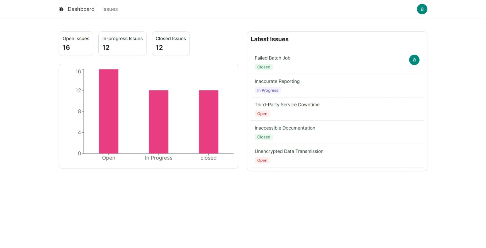

# Issue Tracker

## Description
This project is an issue tracker that helps you keep track of bugs and assign them to team members. It is built with Next.js, a React framework, and uses Prisma to interact with the database. The application allows you to create, read, update, and delete issues. You can also filter by status and sort by title, status, and creation date.



## Live Demo
Check out the live demo [Issue Tracker](https://issue-tracker-app-sigma.vercel.app/)

## Features
- Show a list of issues
- Filtering and sorting issues
- Create a new issue
- Assign an issue to a team member
- Edit an issue
- Delete an issue

## Technologies Used
- **Next.js**: A React framework for building JavaScript applications.
- **React**: A JavaScript library for building user interfaces.
- **TypeScript**: A superset of JavaScript that adds static types to the language.
- **Prisma**: A database toolkit that makes it easy to work with databases.
- **Tailwind CSS**: A utility-first CSS framework for building custom designs.
- **Radix UI**: A collection of low-level UI components for building high-quality design systems and web apps.

## Getting Started
To get a local copy up and running follow these simple example steps.

### Prerequisites
- **Node.js**: : Make sure you have Node.js installed on your system. You can download it from [nodejs.org](https://nodejs.org/).
- MySQL: Make sure you have MySQL installed on your system. You can download it from [MySQL](https://www.mysql.com/).


### Setup
1. Clone the repository
```sh
git clone https://github.com/radouane-oubakhane/issue-tracker-app.git
```

2. Navigate to the project folder
```sh
cd issue-tracker-app
```

3. Install dependencies
```sh
npm install
```

4. Rename the `.env.example` file to `.env` and set all the environment variables.

5. Generate database schema
```sh
npx prisma migrate dev
```
6. Start the development server
```sh
npm run dev
```

7. Open your browser and go to `http://localhost:3000`

## Contributing
Contributions, issues, and feature requests are welcome!

